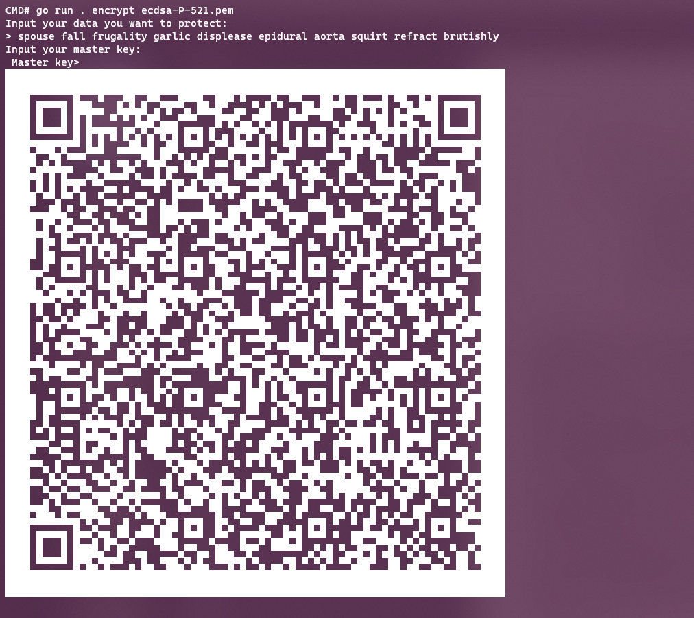
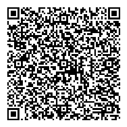

# QR Secrets

_The Argon2 & Elliptic Curve AES encryption scheme_


QR secrets is a cryptographically secure mechanism to store secret data with the highest levels of security. Incorporating; AES256-GCM-HKDF-ARGON2 and ECIES-AES256-GCM-HKDF-SHA256. Rated for a 256 bit security level and requiring two keys, one private Elliptic Curve key and one passphrase known as the Master Key. You only require the master key to encrypt and the public key of Elliptic Curve key. This allows you, if needed, to encrypt on one machine and only decrypt on your hardened secure environment, protecting your other stored secrets from being viewed if one key were to be compromised.

The whole point of this project is to store secrets in encrypted QR codes. This project allows you to securely generate QR codes for sensitive data such as;

- Cryptocurrency Seeds
- Password manager master passwords
- TOTP secrets
- Banking information
- Paper key backups
- Login credentials
- Secure notes
- Or anything you want to keep safe & private

QR secrets allows you to not only export to QR codes but also to files to be stored on Disk or Tape.

# Security Guarantees

1. 256 bit security using [AES256](https://en.wikipedia.org/wiki/Advanced_Encryption_Standard) + Symmetric key + Salt locked behind [PKI](https://en.wikipedia.org/wiki/Public-key_cryptography) with a 521bit Elliptic curve (256 bit security key)
2. Computationally impossible to brute force.
3. Quantum resistance, no known quantum attacks brings 256bit security low enough into a realm where it could be cracked.
4. Even if one key was to be compromised the data would still be secure.
5. Different keys for each "file" encrypted.
6. Hide true plaintext length with padding.
7. Configuration data hidden.
8. Tamper proof, if any bit was to be modified (other than version num & the magic number) the data would not be able to decrypt ([AHEAD Cipher](https://en.wikipedia.org/wiki/Authenticated_encryption)).

# Cryptography & Format Breakdown

The data is stored in a byte format, with 3 distinct sections within whats called a Container.

1. The MetaData section holds the version of the protocol/format, the curve ID and the hash ID which are both used for decrypting the Encrypted Parameters section. And of course it starts with a 16bit magic number to detect the file format of QRsecrets

2. The Encrypted Parameters section. This holds the salt/nonce which is used in the Argon2 KDF. This section also holds the Argon2 parameters and padding size. This section is encrypted using ECIES to the public key.

3. The CipherText section is self explanatory it is the section which holds the encrypted data + padding. It uses AES256-GCM-HKDF-ARGON2 with the Master key and the Salt from the Encrypted Parameters section. You can only decrypt this section if you have decrypted the one above.

# Curves

QR secrets supports the following curves:

- nist-p224
- nist-p256
- nist-p384
- nist-p521
- Brainpool P160t1
- Brainpool P192r1
- Brainpool P192t1
- Brainpool P224r1
- Brainpool P224t1
- Brainpool P256r1
- Brainpool P256t1
- Brainpool P320r1
- Brainpool P320t1
- Brainpool P384r1
- Brainpool P384t1
- Brainpool P512r1
- Brainpool P512t1

# Cryptographic Hash Functions

For the Metadata section the following hash functions are available. All of these functions are ran through HKDF to derive a encryption key.

- SHA256
- SHA512
- SHA3-256
- SHA3-512

## KDF Used for main Encryption

This is used to encrypt your secret and thus needs to be the most secure.

- HKDF-Argon2

# KDFs

QRsecrets doesn't allow the modification of the KDF on the Ciphertext section, but rather allows the KDF parameters to be modified. Using Argon2 and HKDF the key is derived.

# Package

This repo is both a command line tool and a package you can include into your Go applications.

## Install package

```
go get -u github.com/go-compile/qrsecrets
```

```go
package main

import (
    "fmt"
    "log"

    "github.com/1william1/ecc"
    "github.com/go-compile/qrsecrets"
)

func main() {
    secret := "Hello this is my secret"
	hash := qrsecrets.HashSHA256
	curve := elliptic.P256()
	key := "Password123"

	c, err := qrsecrets.NewContainer(
        curve,
        hash,
        []byte(secret),
         64-int32(len(secret)),
    )

	if err != nil {
		log.Fatal(err)
	}

	private, err := ecc.GenerateKey(curve)
	if err != nil {
		log.Fatal(err)
	}

	buf := bytes.NewBuffer(nil)
	if err := c.Encode(buf, private.Public, []byte(key)); err != nil {
		log.Fatal(err)
	}

    fmt.Println(buf.Bytes())
}
```

# Screenshots

|                                                           |
| :-------------------------------------------------------: |
|                       |
| Print the QR code to the terminal, never touches the disk |

|                                               |
| :-------------------------------------------: |
|            |
| Export QR code directly to a file; png or jpg |

# Download

Compatible with all major operating systems and more. Even compatible with a raspberry pi.

- Windows
- Mac
- Linux
- FreeBSD
- OpenBSD
- x86
- Arm
- Arm64

Download the latest from [releases page](https://github.com/go-compile/qrsecrets/releases). You can run via the command line or we recommend adding it to your path.

# CLI Usage

## Encrypt data

```bash
# Basic encrypt with default settings
qrsecrets encrypt ecdsa-P521.pem

# Specify security settings
qrsecrets -preset=high encrypt ecdsa-P521.pem

# Render QR code as PNG
qrsecrets encrypt ecdsa-P521.pem -output=img.png
qrsecrets encrypt ecdsa-P521.pem -output=img.jpg

# Save in binary format instead of using a QR code (required for bigger content)
qrsecrets encrypt ecdsa-P521.pem -output=data.bin

# Encrypt file contents
qrsecrets encrypt ecdsa-P521.pem -file=seed.txt

# Base64 encode output (useful for using external QR scanning/decoding apps)
qrsecrets encrypt ecdsa-P521.pem -base64

# Mixture of different example arguments
qrsecrets -preset=high -hash=sha3_512 encrypt ecdsa-P521.pem -file=seed.txt -output=qr.png

# The masterkey can even be passed in via the CLI, although this is insecure as it will be stored in your bash history
qrsecrets encrypt ecdsa-P521.pem -masterkey="password123"
```

## Decrypt

```bash
# Decode QR code and decrypt
qrsecrets decrypt ecdsa-P521.pem image.png

# Decode and decrypt file
qrsecrets decrypt ecdsa-P521.pem secret.bin

# Decode and decrypt base64 encoded container
qrsecrets decrypt ecdsa-P521.pem image.png -base64

# The masterkey can be passed in via the CLI, although this is insecure as it will be stored in your bash history
qrsecrets decrypt ecdsa-P521.pem image.png - masterkey="password123"
```

## Generate private key

```bash
qrsecrets generatekey

# You can specify the curve by using presets or specify the curve via the -curve= arg.
qrsecrets -curve=p256 generatekey
qrsecrets -preset=high generatekey

# You can encrypt your private key with a passphrase by using the -encrypt=true argument.

qrsecrets -preset=high generatekey -encrypt=true

# You can also specify a file to save the key to
qrsecrets generatekey -output=private.pem
```

## Help

```bash
qrsecrets -help
```

# Build from source

```bash
# Clone repo
git clone github.com/go-compile/qrsecrets
# CD into command folder for the CLI
cd qrsecrets/cmd/qrsecrets

# Go build
go build -ldflags="-s -w" -trimpath
```
